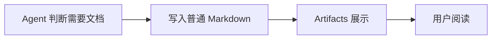

# Artifacts Markdown 展示演示

这是 Agent 写成普通 Markdown 文件后呈现给用户的阅读页面。用户无需登记、提交或选择展示格式。

> [!NOTE]
> 模型完成文档并保存后，调用 `artifacts_present`。页面展示最新文件内容，源文件仍可在编辑器里修改。

## 展示能力

| 内容 | 呈现方式 |
| --- | --- |
| 标题、表格和提示框 | Antigravity 原版 Markdown 组件 |
| 代码块和语法着色 | 原版代码渲染 |
| 流程图与数学公式 | 本地打包的原版资源 |

```javascript
const document = await writeMarkdown('docs/result.md');
await artifacts.present(document);
```



## 数学公式

行内公式：$E = mc^2$。

$$
\sum_{i=1}^{n} i = \frac{n(n+1)}{2}
$$

## 图片与链接


查看[另一份说明](linked.md)。
